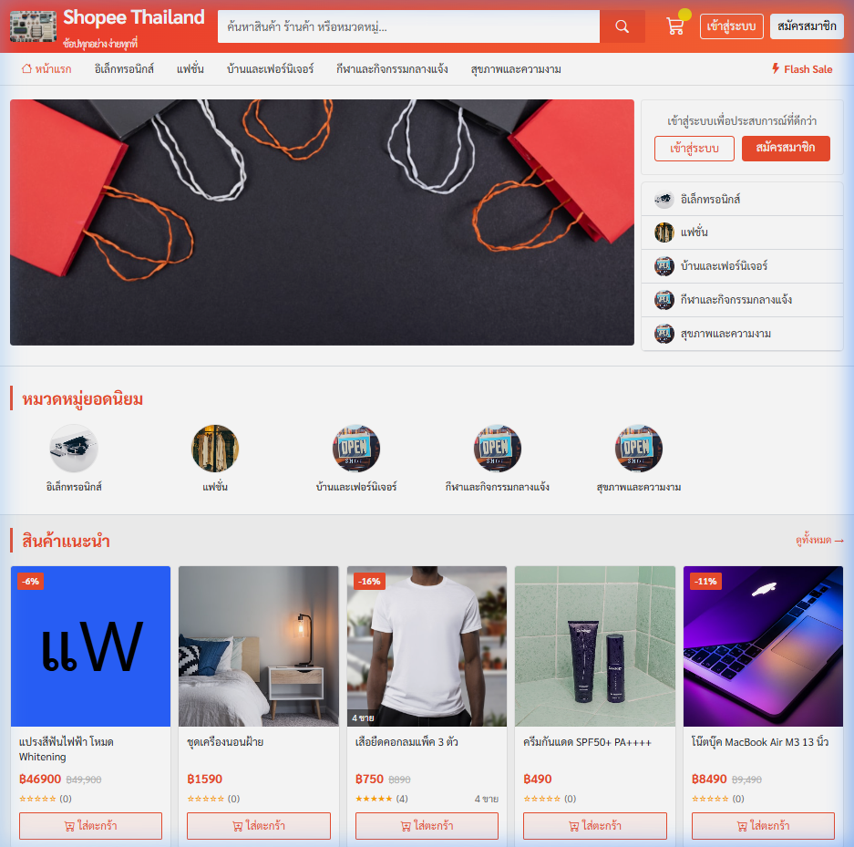
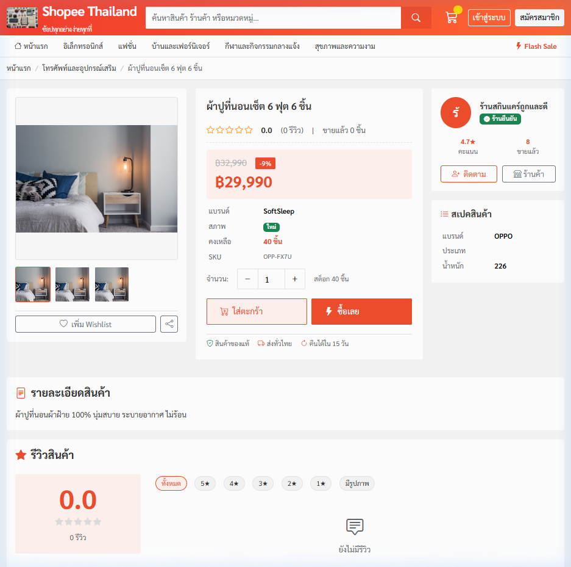
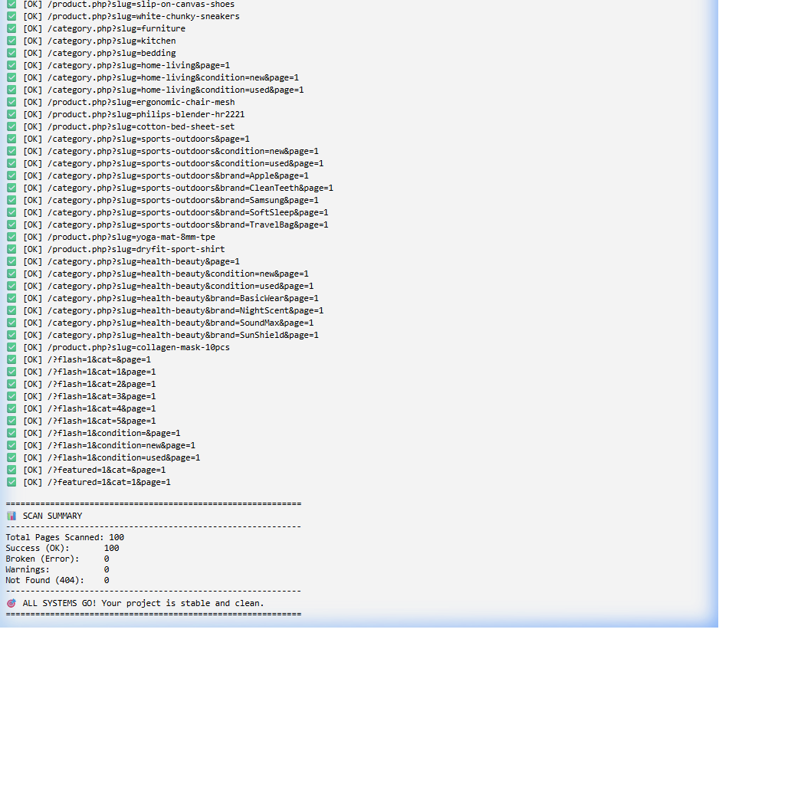

# 🛡️ Shopee TH - Advanced Webshop Ecosystem



### 🇹🇭 ระบบอีคอมเมิร์ซที่สมบูรณ์แบบ แข็งแกร่ง และดูแลตัวเองได้อัตโนมัติ
A robust, self-healing e-commerce platform built with PHP/MySQL, featuring automated testing and universal stability guards.

---

## 🌟 Key Features (ฟีเจอร์เด่น)

### 🤖 Recursive E2E Crawler (แมงมุมนักล่า Error)
ระบบสแกนอัตโนมัติที่ช่วยตรวจสอบความเสถียรของเว็บไซต์ทั้งบ้าน:
- **Dynamic Discovery**: ค้นหาลิงก์ใหม่ๆ และตรวจสอบหน้าสินค้า/หมวดหมู่ทั้งหมดโดยอัตโนมัติ
- **Deep Scanning**: ตรวจจับทั้ง PHP Error, Syntax Error และ SQL Error ล่วงหน้า
- **Real-time Report**: สรุปผลสถานะ OK, Error, 404 แบบเจาะลึก

### 🛡️ Universal Guard System (ระบบเฝ้าระวังครอบจักรวาล)
สถาปัตยกรรมที่ออกแบบมาให้ "ยืดหยุ่น" รองรับการขยายตัวในอนาคต:
- **Image Self-Healing**: ระบบซ่อมแซมรูปภาพที่แตก/โหลดไม่ขึ้นอัตโนมัติ (Global Image Fallback)
- **Centralized Logging**: จดบันทึกทุกปัญหาลง Log ทั่วทั้งโปรเจกต์โดยไม่ต้องเขียนโค้ดเพิ่มในไฟล์ใหม่
- **DB Guard**: ตรวจสอบความถูกต้องของฐานข้อมูลเพื่อป้องกัน SQL Crashes ล่วงหน้า

---

## 🖼️ Preview (ระบบจริง 100%)

````carousel

<!-- slide -->

<!-- slide -->

<!-- slide -->

````

---

## ⚙️ Installation (วิธีติดตั้ง)

1. **Clone Repository**: `git clone https://github.com/yourusername/webshop.git`
2. **Move to XAMPP**: ย้ายโฟลเดอร์โครงการไปไว้ที่ `C:/xampp/htdocs/webshop`
3. **Database Setup**: นำเข้าไฟล์ฐานข้อมูล `webshop` และตั้งค่าใน `/config/database.php`
4. **Ready**: เข้าใช้งานผ่าน [http://localhost/webshop/](http://localhost/webshop/)

---

Developed with ❤️ for high-performance e-commerce.
